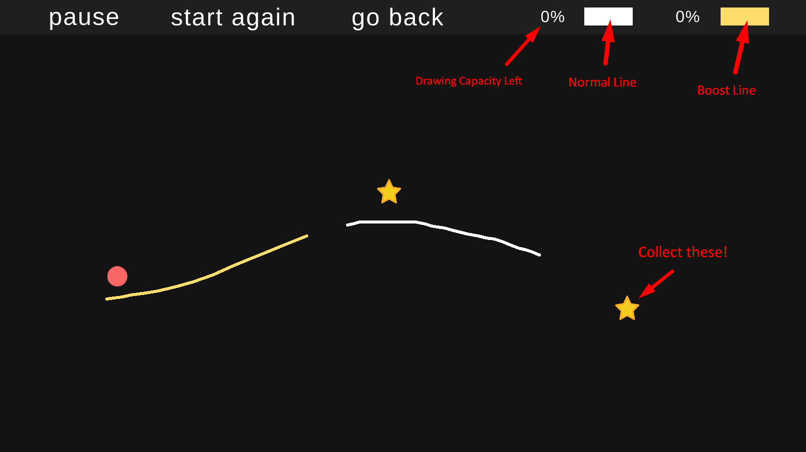
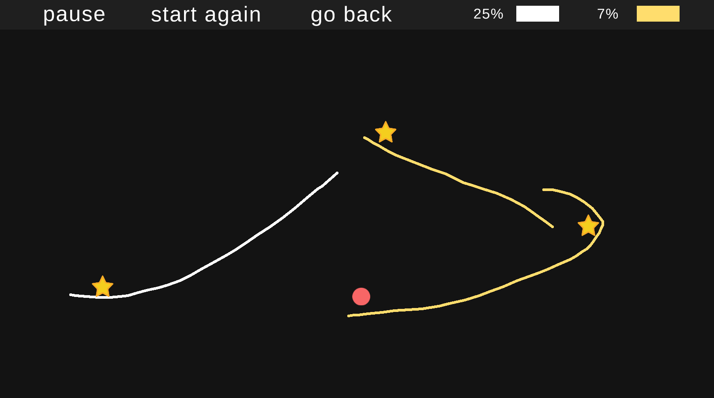
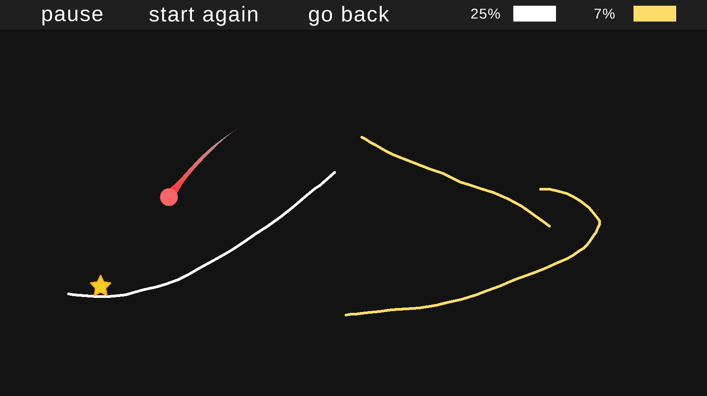
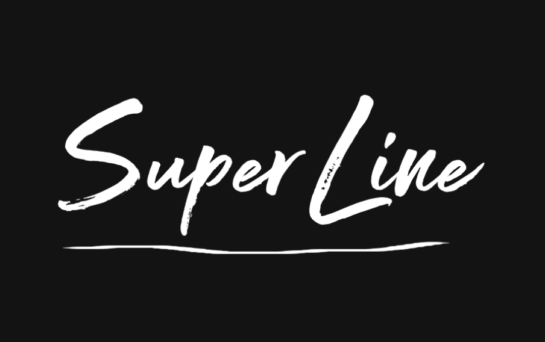

# SuperLine
A puzzle game about drawing lines. Get your player to the end whilst collecting all of the stars to win! Use your creativity to beat all of the levels!

This is a fully independent project that I've worked on over the last few days. It includes plenty of interesting game mechanics, many of which I have had to learn about over the course of the game's creation.

Without further ado, play the game in your web browser here: [SuperLine](https://oktarian.itch.io/superline). There are 8 fun levels for you to beat!

### Features & What I've learned:
* Drawing lines based on the player's mouse movements
* Using a list to be able to track the lines created and remove them if the player wants to (like ctrl + Z)
* Calculating the distance covered by every line and removing that distance from the player's total distance capacity. Then restoring it if the player removes the line.
* Having two different types of lines: normal and boost. The boost line takes into account the initial direction of the mouse movement to decide whether the player will be boosted right or left.
* Game mechanics to control which type of line is used.
* Start menu, pause menu & win menu.
* Level and game management.
* Particle and trail effects.

&nbsp;

&nbsp;

&nbsp;

&nbsp;

